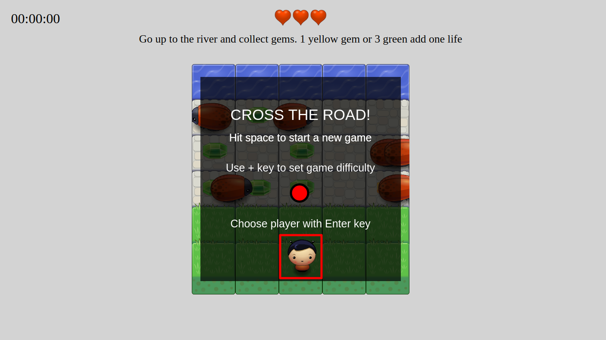

# Fend project #4 Arcade Game #
### Description ###

A classic arcade game following this rules:

The purpose of the game is to have the player cross a road with moving  enemys and reach the river at the top of the game area.  
If a collision occurs the player go back to its origin place. At each collision the player lose one life and after 3 lives the game is over and the player lose. The player must do a final move jumping in the river to win.  
The player can gain lives by collecting gems on its way to the river. Collecting the yelow gem instantly gives him 1 live and he must collect 3 green gems to get one live.
The gems collected, number of lives left and time ellapsed are shown on top of the screen.  

The game has 3 level of difficulties:
- Level 1: easy, enemies are few and moving slowly.
- Level 2: medium, more enemies moving more quickly.
- Level 3: many enemies, moving fast and in both directions.

Game commands are entered with the keyboard:
- Before the game starts:
    - `space` starts the game.
    - `+` slelects the level (cycling choice).
    - `Enter` selects the image of player (cycling choice).
- During the game:
    - `Esc` game pause/resume.
    - `Up arrow` moves player one square up
    - `Down arrow` moves player one squere down
    - `left arrow` moves player one square left
    - `right arrow` moves player one square right

### Version
__V1.00__ 03/24/2018
### Installation ###
Clone repository or compressed files. Then open index.html in your browser. or just <a href="https://alain91530.github.io/projects/memory/index.html">play here</a>

### Realisation ###

Purpose of the project was to use object oriented code. This realisation is organized with 2 main classes of objects:

- Game: this class holds everything about the game logic.
- Character: the items evolving in the game. those items are 3 sub-classes of this one.
    - Enemy: the enemies crossing the game area.
    - Player: the player.
    - Gem: gems to be collected.

Graphic animations are made with with the use of canvas and a game engine provided by Udacity.

### Documentation ###
The following diagrams show the organisation of project. See comments in source files for more detailed information on algorythm used.

### Author ###
Alain CADENAT

### Credits ###
_Mockup and graphic engine_: https://www.udacity.com  
_Emojis_: https://pixabay.com

### License
MIT License

Copyright (c) 2018 Alain CADENAT

Permission is hereby granted, free of charge, to any person obtaining a copy
of this software and associated documentation files (the "Software"), to deal
in the Software without restriction, including without limitation the rights
to use, copy, modify, merge, publish, distribute, sublicense, and/or sell
copies of the Software, and to permit persons to whom the Software is
furnished to do so, subject to the following conditions:

The above copyright notice and this permission notice shall be included in all
copies or substantial portions of the Software.

THE SOFTWARE IS PROVIDED "AS IS", WITHOUT WARRANTY OF ANY KIND, EXPRESS OR
IMPLIED, INCLUDING BUT NOT LIMITED TO THE WARRANTIES OF MERCHANTABILITY,
FITNESS FOR A PARTICULAR PURPOSE AND NONINFRINGEMENT. IN NO EVENT SHALL THE
AUTHORS OR COPYRIGHT HOLDERS BE LIABLE FOR ANY CLAIM, DAMAGES OR OTHER
LIABILITY, WHETHER IN AN ACTION OF CONTRACT, TORT OR OTHERWISE, ARISING FROM,
OUT OF OR IN CONNECTION WITH THE SOFTWARE OR THE USE OR OTHER DEALINGS IN THE
SOFTWARE.
